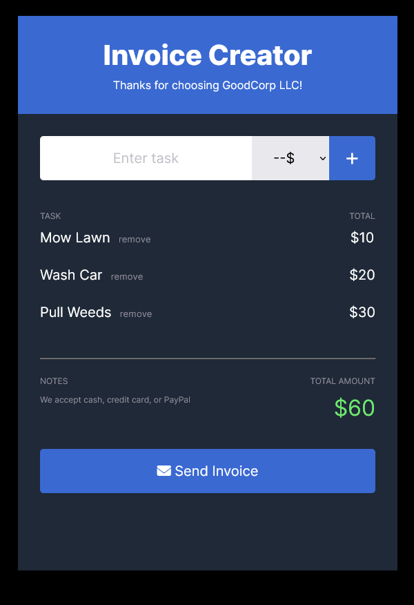
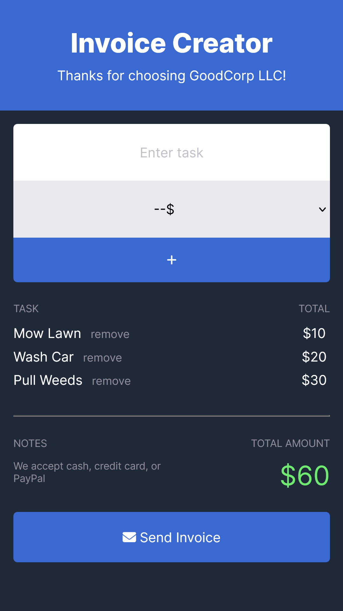

 ## Table of contents

- [Overview](#overview)
  - [The challenge](#the-challenge)
  - [Screenshot](#screenshot)
  - [Links](#links)
- [My process](#my-process)
  - [Built with](#built-with)
  - [What I learned](#what-i-learned)
  - [Continued development](#continued-development)
  - [Useful resources](#useful-resources)
- [Author](#author)
- [Acknowledgments](#acknowledgments)


### Overview

Scrimba M5 bootcamp project - invoice creator
-[Scrim](https://scrimba.com/scrim/coffa4aeba9a29f65b0d45dd0)


### The challenge

Requirements
- create array to hold requested tasks
- buttons to add a task to array
- display data from array; should update when array changes
- charge only once for each task (don't add duplicates)
- update total amount each time a task gets added
- button to "send invoice" (reset) - reset form and total amount

Stretch goals
- enter tasks with small form
  - text field for task
  - select menu with cost options
  - add new task and cost to the array and update task list
- remove tasks from list, also removes from total amount

Personal stretch goals
- mobile-first design
- responsive design

[Figma file](https://www.figma.com/file/J65OauJ0iGEx3xNHGezVaS/Invoice-Creator-(Copy)?t=C6WQSI9kYNScW39R-0)

### Screenshot




### Links

Project locations:
-[Scrim](https://scrimba.com/scrim/co37946fd8d57137e0724c598)
-[Github](https://github.com/casserole27/invoice-creator)
-[Live Site](http://www.clewisdev.com/invoice-creator/)

## My process

- Create Github repository
- Set up basic HTML file 
- Set up basic CSS file
- Set up basic JavaScript file
- Consult Figma design files
- Project work
- Publish live URL
- Check markup and accessibility
  -(https://validator.w3.org/)
  -(https://wave.webaim.org/)
- README file

### Built with
- Github using command line
- semantic HTML5
- CSS custom properties
- Mobile-first design
- Responsive Web Design
- vanilla JavaScript
- ARIA roles / accessibility
- UI updates for better UX

### What I learned
- how to apply a uuid to identify array elements
- thinking about methods that create new arrays vs. methods that apply to elements of arrays
- making a render() function for DRYer code, I had these functions called in multiple places

```javascript
function render () {
    renderTasksArray(taskArray);
    taskUl.innerHTML = renderTasksList(taskArray)
    priceUl.innerHTML = renderPriceList(taskArray)
    totalAmt.innerText = renderTotalPrice(taskArray)
};
```

- review preventDefault() method for proper input and rendering functionality
- "submit" event handler for working with forms

```javascript
function handleFormSubmit(e) {
    e.preventDefault(); //Prevent form submission from rendering lists
    render();
    taskInput.value = "";
    priceSelect.value = "";
};

document.getElementById('invoice-form').addEventListener("submit", handleFormSubmit);
```

### Continued development

- Command line - is it possible to move changed files to a different branch before committing? I tried to switch because I realized I was on the wrong branch and things got messy.

- Code reviewer notes


### Useful resources

[Scrimba help](https://different-marmoset-f7b.notion.site/Invoice-Creator-8bf9b4c09ef542d3a2d950c987738c21)

[freeCodeCamp - removing an element from JS array](https://www.freecodecamp.org/news/how-to-remove-an-element-from-a-javascript-array-removing-a-specific-item-in-js/#remove-an-element-at-any-index-with-splice)

ChatGPT prompts:
- How would I refactor this code so that the HTML form input  works correctly?
- What should I do in the HTML?
```html
      <form action="">
```
- When I click the 'send-btn' element to execute the reset function, the text input says "please fill out this field". Why is that?

## Author

- Website - [C Lewis](https://www.clewisdev.com)
- LinkedIn - [LinkedIn](https://www.linkedin.com/in/clewisdev/)

## Acknowledgments


